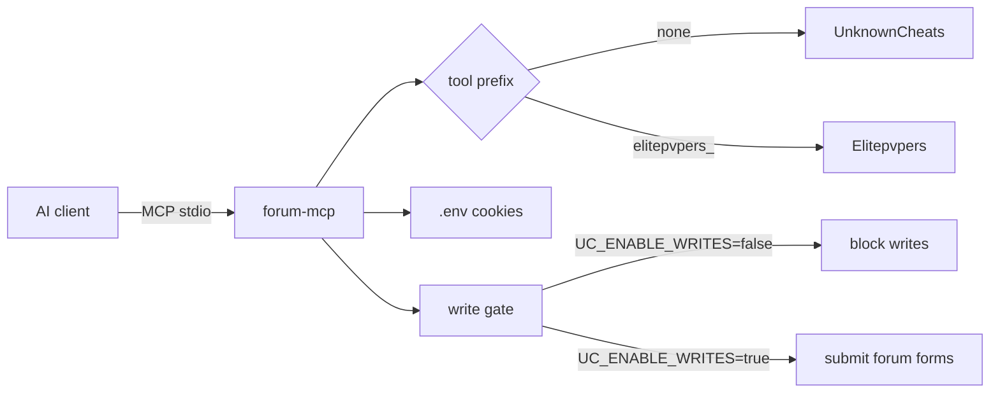
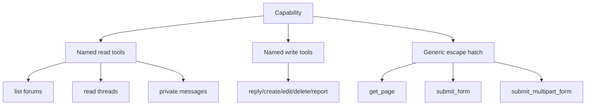
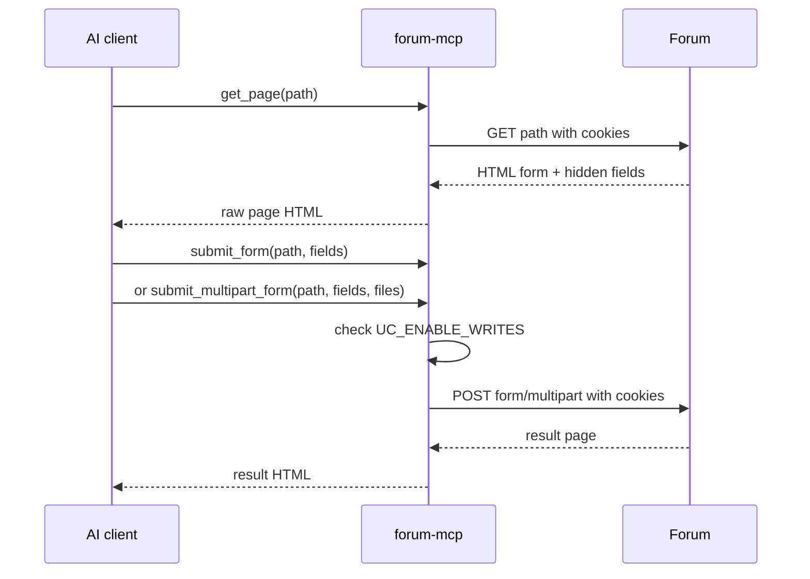

# Forum MCP

<p align="center">
  <b>Rust MCP server for UnknownCheats + Elitepvpers</b><br>
  Authenticated vBulletin forum tools over stdio, with secrets kept local.
</p>

<p align="center">
  
  
  
  
</p>

---

## What it does

Forum MCP gives AI clients a local, publishable bridge to two vBulletin-style forums:

| Forum | Tool prefix | Auth source | Reads | Writes |
|---|---:|---|---:|---:|
| UnknownCheats | none | `UC_COOKIE` | yes | gated |
| Elitepvpers | `elitepvpers_` | `EP_COOKIE` | yes | gated |

Write tools never run unless `UC_ENABLE_WRITES=true` is set in your local `.env`.



---

## Quickstart

```bash
git clone https://github.com/yourname/unknowncheats-mcp.git
cd unknowncheats-mcp
cp .env.example .env
# edit .env with your local cookies
cargo build --release
```

Add to your MCP client:

```json
{
  "mcpServers": {
    "forum-mcp": {
      "command": "/absolute/path/to/unknowncheats-mcp/target/release/unknowncheats-mcp",
      "cwd": "/absolute/path/to/unknowncheats-mcp"
    }
  }
}
```

---

## Environment

`.env` is intentionally ignored by git.

```env
UC_BASE_URL=https://www.unknowncheats.me/forum/
UC_COOKIE="bbsessionhash=...; bbuserid=...; bbpassword=...; darktheme_enabled=1"
UC_USERNAME=
UC_PASSWORD=

EP_BASE_URL=https://www.elitepvpers.com/forum/
EP_COOKIE="bbsessionhash=...; bbuserid=...; bbpassword=...; vbseo_loggedin=yes"
EP_USERNAME=
EP_PASSWORD=

UC_ENABLE_WRITES=false
```

| Variable | Required | Purpose |
|---|---:|---|
| `UC_COOKIE` | yes | UnknownCheats authenticated cookie header |
| `EP_COOKIE` | no | Elitepvpers authenticated cookie header |
| `UC_ENABLE_WRITES` | no | Enables all write/form tools when `true` |
| `*_BASE_URL` | no | Override forum URL for forks/mirrors |
| `*_USERNAME`, `*_PASSWORD` | no | Stored for future auth workflows; cookies are used now |

---

## Cloudflare Bypass

Both UnknownCheats and Elitepvpers may present Cloudflare challenges.

**Automatic (requires Docker):**
- When a request returns a Cloudflare challenge, the MCP auto-spawns [FlareSolverr](https://github.com/FlareSolverr/FlareSolverr) via Docker
- Seeds the browser session with your forum cookies, solves the challenge, and reuses the provider session for later requests
- Used for challenged GETs and form-encoded POSTs; multipart uploads are warmed via FlareSolverr and retried through `reqwest`

**Manual (no Docker):**
1. Visit the forum in a browser
2. Complete the Cloudflare check
3. Export all cookies from browser devtools (Application > Cookies)
4. Include `cf_clearance` in the matching `*_COOKIE` value if present

---

## Capabilities

The server aims for practical full normal-user coverage through three layers:

1. **Named tools** for common forum actions.
2. **Generic `get_page` + `submit_form`** for any text-only form your account can access.
3. **Generic `submit_multipart_form`** for uploads/attachments and file-backed forms.



### Read/account tools

| UnknownCheats | Elitepvpers | Description |
|---|---|---|
| `list_forums` | `elitepvpers_list_forums` | List forum categories |
| `search_forum` | `elitepvpers_search_forum` | Search threads |
| `list_threads` | `elitepvpers_list_threads` | List threads in a forum |
| `read_thread` | `elitepvpers_read_thread` | Read posts in a thread |
| `get_profile` | `elitepvpers_get_profile` | Fetch user profile page |
| `get_logged_in_user` | `elitepvpers_get_logged_in_user` | Fetch account page |
| `list_private_messages` | `elitepvpers_list_private_messages` | Fetch PM page |
| `user_cp` | `elitepvpers_user_cp` | Fetch user control panel |
| `subscribed_threads` | `elitepvpers_subscribed_threads` | Fetch subscriptions |
| `attachments` | `elitepvpers_attachments` | Fetch attachment manager |
| `get_page` | `elitepvpers_get_page` | Fetch any forum-relative page |

### Write/form tools

All tools below require `UC_ENABLE_WRITES=true`.

| UnknownCheats | Elitepvpers | Description |
|---|---|---|
| `reply_to_thread` | `elitepvpers_reply_to_thread` | Reply to a thread |
| `create_thread` | `elitepvpers_create_thread` | Create a thread |
| `send_private_message` | `elitepvpers_send_private_message` | Send PM |
| `edit_post` | `elitepvpers_edit_post` | Edit post if permitted |
| `delete_post` | `elitepvpers_delete_post` | Delete post if permitted |
| `report_post` | `elitepvpers_report_post` | Report post |
| `submit_form` | `elitepvpers_submit_form` | Submit any form path with fields |
| `submit_multipart_form` | `elitepvpers_submit_multipart_form` | Submit multipart forms with local files |

---

## Generic form workflow

Use this when a site feature has no named tool.



Example:

```json
{
  "path": "profile.php?do=updateprofile",
  "fields": {
    "field_name": "value",
    "securitytoken": "token-from-get_page"
  }
}
```

Multipart upload:

```json
{
  "path": "newattachment.php?do=manageattach",
  "fields": {
    "securitytoken": "token-from-get_page"
  },
  "files": [
    {
      "field": "upload",
      "path": "/absolute/path/to/file.zip"
    }
  ]
}
```

---

## Safety checklist before publishing

- `.env` exists locally only
- `.env.example` contains placeholders only
- no real cookies in README, tests, CI, or docs
- writes disabled by default
- CI runs fmt, clippy, tests

Quick local check:

```bash
cargo fmt --check
cargo clippy --all-targets -- -D warnings
cargo test
cargo build --release
```

---

## Development

```bash
cargo test
cargo fmt
cargo clippy --all-targets -- -D warnings
```

Project layout:

```text
src/
  cloudflare.rs    # Byparr/FlareSolverr integration for EPVP
  config.rs        # .env loading and secret redaction
  forum_client.rs  # authenticated vBulletin HTTP client
  mcp.rs           # MCP JSON-RPC tool dispatch
  parser.rs        # small HTML parsers
```

---

## Notes

- HTML parsing is template-dependent. If either forum changes markup, update `parser.rs` and tests.
- Generic `get_page` + `submit_form` covers account-level capabilities without hardcoding every forum form.
- Admin/mod-only actions still depend on the permissions of the cookies you provide.